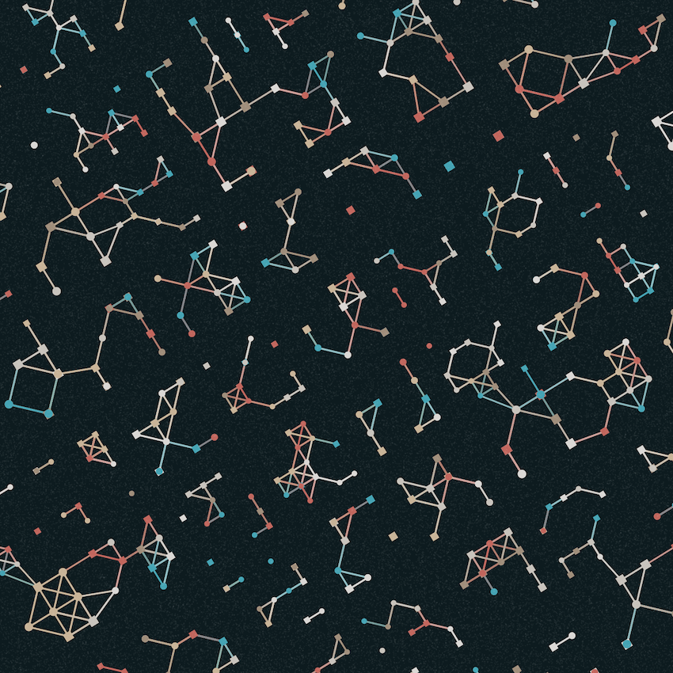
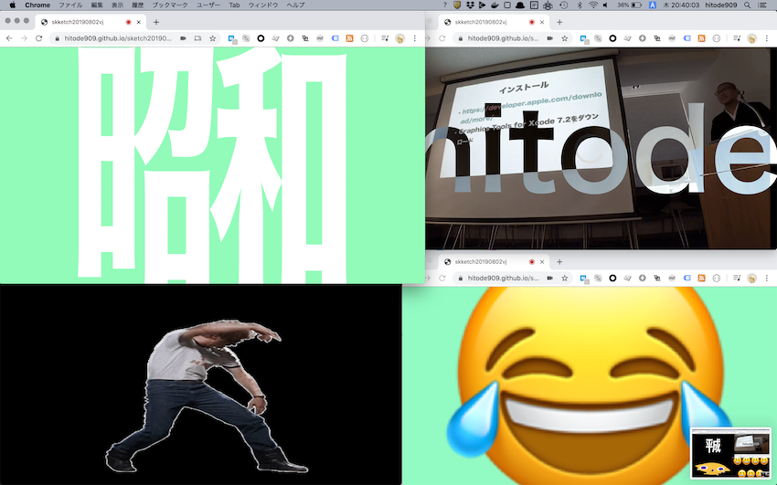

「Audiovisual Workshop with TOPLAP Japan」はライブコーディング，オーディオ・ビジュアル表現をテーマにしたワークショップとパフォーマンスのイベントです．ライブコーディング環境 Orca による音響表現と，ウェブブラウザから操作する VJ システムの 2 つのワークショップを行い，その成果を特設会場で発表します．

## ~Audiovisual Workshop with TOPLAP Japan~

### [日時] ： 2019 年 11 月 30 日（土）

### [時間] ： 9:30-18:00

### [場所] ： 甲南女子大学 10 号館 1020 教室/8 号館スタジオ (〒 658-0001 兵庫県神戸市東灘区森北町 6 丁目 2-23 [大学への交通アクセス][3])

### [定員] ： 30 名

### [参加費用] ： 無料

### [内容] ：

#### 「ORCA によるライブコーディング導入編」

ORCA はブロックのようなアルファベットのオペレーターを組み合わせて音楽を作曲していくプログラム言語とシーケンサーが組み合わさったような不思議なツールです。見た目は少し無骨で難解なようですが、ライブコーディング(コードをその場で編集して実行しながら行うパフォーマンスするスタイル)のために作られたこともあり、覚えることは意外に少なく始めやすいでしょう。手早くアイデアを試したい時や、逆に巨大なセットを組みたい時でも良いツールです。ワークショップでは、オペレーターの使い方と Pilot という専用のミニシンセサイザーのソフトを使って作曲を始めるまでを一緒にやりたいと思います。 [https://wiki.xxiivv.com/#orca][1]

#### 「ひとでくんさんワークショップ」

古典的なホームページから検索エンジン、SNS、動画サイトまで、普段わたしたちがウェブブラウザで見ているありとあらゆるページは HTML、CSS、JavaScript という技術の組み合わせで作られています。
このワークショップでは、HTML、CSS、JavaScript をつかってブラウザに愉快なビジュアルを表示する方法を学びます。
さまざまな機能を持っているウェブブラウザのうち、絵を出すことに着目した機能だけを使い、良い絵を出し、音楽に合わせて絵を動かすことを目指します。

### [タイムテーブル]

- 9:30 ~ ORCA ワークショップ with moxus (10 号館 1020 教室)

- 15:00 ~ Web VJ ワークショップ with hitode909 (10 号館 1020 教室)

- 17:30~ パフォーマンス (8 号館スタジオ)

### [お問い合わせ] : takawo@konan-wu.ac.jp

### コーディネーター : 高尾俊介講師，水野勝仁准教授

### ワークショップ講師：moxus，hitode909

### [参加方法]：登録フォームより参加お申し込みお願いします [http://google.com][2]

### [参加するにあたって] : 使用するコンピューターは各自持参お願いいたします。

[1]: https://wiki.xxiivv.com/#orca
[2]: https://goo.gl/forms/F8n2nTlA0kNzPOQq2
[3]: https://www.konan-wu.ac.jp/access/
